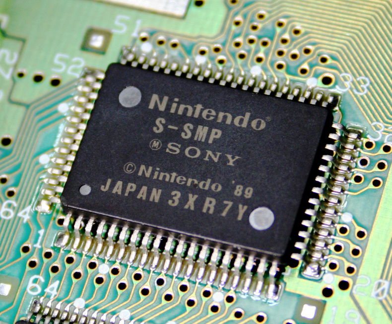

# SPCtag : Java SPC tag reader (SNES Sound Files)


[SPCTag](https://github.com/ullenius/spctag) is a Java stand-alone command line app for reading the ID666 tags from SNES SPC-files.

SPC-files are sound files containing ripped chiptune music from Super Nintendo and Super Famicom games. They are named after the Sony SPC-700 sound chip created by Ken Kutaragi (who later became the father of the Playstation).

**Not** for *PKCS#7* certificates who share the same filename extension.

## :desktop_computer: Usage

```sh
usage: spctag <filename>
 -v,--verbose   verbose output
 -V,--version   print version
 -x,--xid6      print xid6 tags
```

For example:
```sh
$ java -jar spctag -v "/warez/spc/dkc2/17 Stickerbrush Symphony.spc"

File header: SNES-SPC700 Sound File Data v0.30
Tag format: Text
Artist: Dave Wise
Song title: Stickerbrush Symphony
Game title: Donkey Kong Country 2
Name of dumper: Datschge
Comments: Bramble Maze
Date SPC was dumped:
Emulator used to dump SPC: Unknown
-----------
XID6 tags:
-----------
Publisher's name: Rare, Nintendo
Copyright year: 1995
Introduction length: 25.3
Fade length: 640000
```

## Features

* :heavy_check_mark: 100% Java (Java 11) :coffee:
* :heavy_check_mark: Supports UTF-8 encoding in the tags!
* :heavy_check_mark: Command line. Multi-platform.
* :heavy_check_mark: Batch processing using wildcards is possible! For example: `java -jar spctag *.spc`
* :heavy_check_mark:: xid6 support (extended tags).
* :x: Edit tags (as of yet)

## :floppy_disk: Building
This is a Maven-project.

Run:
```sh
mvn clean install assembly:single
```
to build the JAR-file.

## :file_folder: Binaries
I've included a compiled jar-file with /lib dir to simplify for end-users who can't compile stuff on their platform.
* Download **spctag-bin.zip**


## :wrench: Development
1. I wrote this because there was a lack of tools supporting the SPC-format.
1. And it would be a fun project to learn binary I/O in Java.
1. Lastly, **spctag** has the best support for parsing the *"Emulator used for dumping SPC"*-tag :grin:

Most of the existing tools are 15-20 year old legacy Windows programs that won't run on modern computers. The source code is lost. Or it was written in C/C++ for 32-bit architecture and won't compile on modern 64-bit computers.

Java is multi-platform and you can run and compile 20-year old Java programs without any issues. So I'd figure this would be a suitable platform for posterity.

Hopefully doing it in Java makes it easy to convert to XML and JSON, as well as persisting it in databases using SQL.

## :id: Emulator Dump Tag
The *Emulator used for dumping*-value is set by 1 byte-flag. In two different 
offset locations depending on if the SPC-file is using binary or text-format for 
storing the ID666-tag.

* Binary offset   `0xD1`
* Text offset:    `0xD2`

There are two different set of specifications for emulator codes available. The legacy SPC-file specification and the newer Japanese one. SPCTag supports both of them.

### :jp: Japanese spec
The following byte-values are used according to the [Japanese spec](https://dgrfactory.jp/spcplay/id666.html):

Emulator name | Text format | Binary format
------------ | -------------| -------------
Unknown | 0x30 | 0x00
ZSNES | 0x31 | 0x01
Snes9x| 0x32 | 0x02
ZST2SPC| 0x33| 0x03
Other | 0x34 | 0x04
SNEShout| 0x35 | 0x05
ZSNES / W | 0x36 | 0x06
Snes9xpp | 0x37 | 0x07
SNESGT | 0x38 | 0x08

Note: *Other* and *Unknown* are both specified with unique values (?) somehow...

### :older_woman: Legacy spec
Only 3 values are defined in the legacy spec (SPC File Format v.0.31 txt-file)

Emulator name | Text format | Binary format
------------ | -------------| -------------
Unknown | 0x0 | 0x00
ZSNES | 0x01 | 0x01
Snes9x| 0x02 | 0x02

### :factory: Factory Method
* *se.anosh.spctag.emulator.factory* contains a factory method pattern (*Gang of Four*). 
* Used for creating immutable *Emulator*-objects based on the two aforementioned tables.

#### Usage example:
```java
EmulatorFactory myFactory = new ModernEmulatorFactory(); // First we create the factory

Emulator emulatorUsed = myFacftory.orderEmulator(0x31, Type.JAPANESE) // Type.LEGACY is also available
```

## Changelog
* 0.3.5 - fix id666 dumped date output
* 0.3.4 - fix bug that crashed if dumped date was missing. Fix log warning
* 0.3.3 - fix id666 dumped date parsing (binary format)
* 0.3 - add xid6 support (extended tags). Update to Java 11. September 2021
* 0.2 - utf8 support. November 2019
* 0.1 - first release! February 2019

## :scroll::Licence
GPL 3 only. See COPYING

### Libraries used & credit
* Apache Commons CLI-library - [Apache Licence version 2](https://www.apache.org/licenses/LICENSE-2.0)
* tinylog - [Apache Licence version 2](https://www.apache.org/licenses/LICENSE-2.0)
* [S-SMP chip for SFC](https://commons.wikimedia.org/wiki/File:S-SMP_01.jpg) - made by [Yaca2671](https://commons.wikimedia.org/wiki/User_talk:Yaca2671) (2007). [Creative Commons Attribution-Share-Alike](https://creativecommons.org/licenses/by-sa/3.0/) 3.0 Unported licence.

## Dedication
SPCtag is dedicated to my favourite OC remixer [Avien](https://ocremix.org/artist/4402/avien) (1986-2004). RIP :notes: :saxophone:
